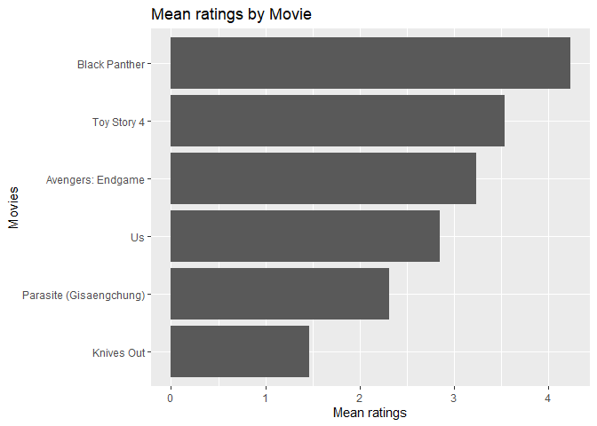

Simple movie recommendations based on friends ratings
================
Esteban Aramayo

1.  Overview

2.  Preparing the Data

    2.1 Collecting the data through an online survey

    2.2 Loading the survey’s responses into a relational database

    2.3 Retrieving movie rating survey data from database

    2.4 Handling missing rating values

3.  Exploring the Data

    3.1 The Mean and Median ratings for each movie

    3.2 Bar chart of mean ratings per movie

4.  Movie recommendations

    4.1 Movie recommendation candidate people

    4.2 Average movie ratings to be used for movie recommendations

    4.3 Final movie recommendations

## 1 Overview

I wanted to create a simple movie recommendation system (without using
machine learning models) based on ratings collected from people that I
know (friends, family, classmates). The goal is to come up with at least
1 movie recommendation for each of my friends based on the ratings
provided by all my friends. It is not allowed to recommend a movie to a
friend if he/she already watched it.

I chose six recent popular movies. I asked at least five people that I
know to rate each of these movies that they have seen on a scale of 1 to
5. I took the results (observations) and stored them in a MySQL
database. Loaded the information from the MySQL database into an R
dataframe. Then I performed the necessary steps to clean up the data,
analyze it, and come up with the appropriate movie recommendations.

## 2 Preparing the Data

### 2.1 Collecting the data through an online survey

I selected 6 recent movies for which to get ratings for.

I collected the movie ratings through an
<a href="https://www.surveymonkey.com/r/DLBX65K">online survey</a> using
“surveymonkey.com”.

Below is a sample of the questions and answers provided by one of the
responders.

Thirteen people responded to the survey. Below are the
<a href="https://www.surveymonkey.com/summary/Q7xn8eZ0gWfv2OpKkmCOFnYknsWDuNPJI47tmxRgS_2FI_3D?tab_clicked=1">responses
summary results</a>.

### 2.2 Loading the survey’s responses into a relational database

The following tasks were performed to store the survey’s responses into
a MySQL relational database:

-   I manually downloaded and saved the response results of the online
    survey to a CSV file.
-   Using MySQL Workbench’s “Table Data Import Wizard” feature, I loaded
    the data from the CSV file into a single table of a MySQL database.
-   I created multiple normalized tables to store the survey data. Those
    tables have the proper primary keys and foreign relationships among
    them.
-   In the database, for future reporting purposes, I created a
    convenient physical view, which joins the normalized tables to show
    an overall view of the survey results.
-   Using MySQL Workbench’s “Forward Engineer Database” feature, I
    generated an SQL script to create the “movies” schema and its
    corresponding objects.
-   Using SQL code, I read the data from the single table where the CSV
    file data was loaded, then I loaded them into the normalized tables.
-   I also created SQL scripts to create the “movies” schema on the
    MySQL server, create its tables and views, and populate the data in
    the tables.Script names are
    “01\_create\_movies\_schema\_and\_its\_objects.sql” and
    “02\_populate\_tables\_in\_movies\_schema.sql”.
-   Using MySQL Workbench’s “Reverse Engineer Database” feature, I
    created a model of the schema and its corresponding Entity
    Relationship diagram.

### 2.3 Retrieving movie rating survey data from database

Using a view, let’s take a peek at some of the movie rating records
retrieved from the database.

    ##    movie_id              movie_name release_year person_name rating_value
    ## 1         1           Black Panther         2018      Elliot            4
    ## 2         1           Black Panther         2018      Sandra            4
    ## 3         1           Black Panther         2018        Jake            5
    ## 4         1           Black Panther         2018        Alex            3
    ## 5         1           Black Panther         2018   Jeannette            5
    ## 6         1           Black Panther         2018         Mya            5
    ## 7         1           Black Panther         2018     Natalie            5
    ## 8         1           Black Panther         2018       Diana            5
    ## 9         1           Black Panther         2018      Leslie            5
    ## 10        1           Black Panther         2018       Stacy            4
    ## 11        1           Black Panther         2018     Ginette            5
    ## 12        1           Black Panther         2018      Andres           NA
    ## 13        1           Black Panther         2018       Cesar            5
    ## 14        2 Parasite (Gisaengchung)         2019      Elliot            5
    ## 15        2 Parasite (Gisaengchung)         2019      Sandra           NA
    ## 16        2 Parasite (Gisaengchung)         2019        Jake            3
    ## 17        2 Parasite (Gisaengchung)         2019        Alex            3
    ## 18        2 Parasite (Gisaengchung)         2019   Jeannette           NA
    ## 19        2 Parasite (Gisaengchung)         2019         Mya           NA
    ## 20        2 Parasite (Gisaengchung)         2019     Natalie            5

### 2.4 Handling missing rating values

Because some people did not see some of the movies, the are some NA
values for the rating variable, which might skew the results of the
recommendations. Therefore, we can either convert NA values to 0 or
perhaps replace them with the mean/median values for the particular
movie. For simplicity, I converted **NA** values to **zeroes**.

    ##    movie_id              movie_name release_year person_name rating_value
    ## 1         1           Black Panther         2018      Elliot            4
    ## 2         1           Black Panther         2018      Sandra            4
    ## 3         1           Black Panther         2018        Jake            5
    ## 4         1           Black Panther         2018        Alex            3
    ## 5         1           Black Panther         2018   Jeannette            5
    ## 6         1           Black Panther         2018         Mya            5
    ## 7         1           Black Panther         2018     Natalie            5
    ## 8         1           Black Panther         2018       Diana            5
    ## 9         1           Black Panther         2018      Leslie            5
    ## 10        1           Black Panther         2018       Stacy            4
    ## 11        1           Black Panther         2018     Ginette            5
    ## 12        1           Black Panther         2018      Andres            0
    ## 13        1           Black Panther         2018       Cesar            5
    ## 14        2 Parasite (Gisaengchung)         2019      Elliot            5
    ## 15        2 Parasite (Gisaengchung)         2019      Sandra            0
    ## 16        2 Parasite (Gisaengchung)         2019        Jake            3
    ## 17        2 Parasite (Gisaengchung)         2019        Alex            3
    ## 18        2 Parasite (Gisaengchung)         2019   Jeannette            0
    ## 19        2 Parasite (Gisaengchung)         2019         Mya            0
    ## 20        2 Parasite (Gisaengchung)         2019     Natalie            5

## 3 Exploring the Data

### 3.1 The Mean and Median ratings for each movie

    ## # A tibble: 6 x 4
    ## # Groups:   movie_id [6]
    ##   movie_id movie_name              rating_mean rating_median
    ##      <int> <chr>                         <dbl>         <dbl>
    ## 1        1 Black Panther                  4.23             5
    ## 2        2 Parasite (Gisaengchung)        2.31             3
    ## 3        3 Avengers: Endgame              3.23             3
    ## 4        4 Knives Out                     1.46             1
    ## 5        5 Us                             2.85             4
    ## 6        6 Toy Story 4                    3.54             4

### 3.2 Bar chart of mean ratings per movie

<!-- -->

The top highest rated movie is **“Black Panther”** with a mean of
**4.23**.

## 4 Movie recommendations

The approach here is as follows:

-   Identify those people who did not watch any of the chosen movies
    from the survey. Thus, they become the potential recommendation
    candidates.
-   For those movies which the person has not watched yet, find their
    average rating calculated from the provided via surevey responses by
    the people who did watch such movies.
-   Since the movie rating scale in the survey goes from 1 to 5 (where 1
    is the lowest and 5 is the highest), we will recommend movies only
    if their rating was greater than 2.5 (i.e. greater than 50%). Movies
    recommendations with rating lower than the scale average are
    discarded.

### 4.1 Movie recommendation candidate people

Below is the list of **recommendation candidate people** and the movies
that they have not seen yet:

    ##    person_name              movie_name release_year movie_id
    ## 9       Andres       Avengers: Endgame         2019        3
    ## 1       Andres           Black Panther         2018        1
    ## 15      Andres              Knives Out         2019        4
    ## 7        Cesar Parasite (Gisaengchung)         2019        2
    ## 12       Diana              Knives Out         2019        4
    ## 5        Diana Parasite (Gisaengchung)         2019        2
    ## 17       Diana                      Us         2019        5
    ## 8      Ginette       Avengers: Endgame         2019        3
    ## 14     Ginette              Knives Out         2019        4
    ## 10   Jeannette              Knives Out         2019        4
    ## 3    Jeannette Parasite (Gisaengchung)         2019        2
    ## 13      Leslie              Knives Out         2019        4
    ## 6       Leslie Parasite (Gisaengchung)         2019        2
    ## 18      Leslie                      Us         2019        5
    ## 11         Mya              Knives Out         2019        4
    ## 4          Mya Parasite (Gisaengchung)         2019        2
    ## 16         Mya                      Us         2019        5
    ## 2       Sandra Parasite (Gisaengchung)         2019        2
    ## 19      Sandra             Toy Story 4         2019        6

### 4.2 Average movie ratings to be used for movie recommendations

The **average ratings for all the movies** in the survey are:

    ## # A tibble: 6 x 4
    ## # Groups:   movie_id [6]
    ##   movie_id movie_name              rating_mean rating_median
    ##      <int> <chr>                         <dbl>         <dbl>
    ## 1        3 Avengers: Endgame              3.23             3
    ## 2        1 Black Panther                  4.23             5
    ## 3        4 Knives Out                     1.46             1
    ## 4        2 Parasite (Gisaengchung)        2.31             3
    ## 5        6 Toy Story 4                    3.54             4
    ## 6        5 Us                             2.85             4

### 4.3 Final movie recommendations

The **final movie recommendations are only the ones where the average
rating is greater than 2.5**. Movies recommendations with rating lower
than the scale average are not recommended. Later in the course we will
learn advanced techniques on how to perform sophisticated
recommendations.

    ##   person_name      movie_name.x release_year rating_mean
    ## 1      Andres     Black Panther         2018    4.230769
    ## 3      Andres Avengers: Endgame         2019    3.230769
    ## 5       Diana                Us         2019    2.846154
    ## 2     Ginette Avengers: Endgame         2019    3.230769
    ## 6      Leslie                Us         2019    2.846154
    ## 4         Mya                Us         2019    2.846154
    ## 7      Sandra       Toy Story 4         2019    3.538462
