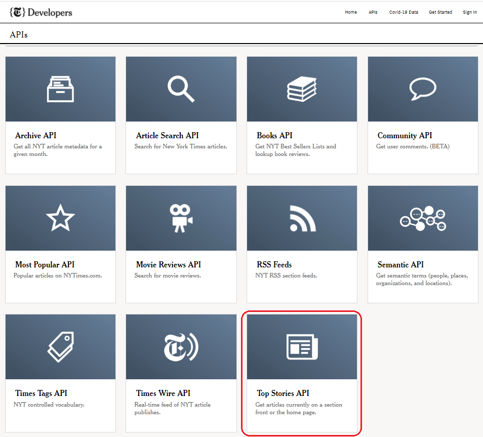

```{r setup, include = FALSE}
knitr::opts_chunk$set(
  collapse = TRUE,
  comment = "#>"
)
```

### Assignment Description

The New York Times web site provides a rich set of APIs, as described here: https://developer.nytimes.com/apis

You’ll need to start by signing up for an API key.

Your task is to choose one of the New York Times APIs, construct an interface in R to read in the JSON data, and transform it into an R DataFrame.


### NY Times API options

The currently available NY Times APIs are shown below


```{r out.width = "50%", fig.align = "center", echo=FALSE}


```


For this assignment I chose to create an iterface to use the **"Top Stories" API**. Below is a brief description of what this API returns and how its available end points can be accessed via proper pre-built url strings.

**Top Stories API**

The Top Stories API returns an array of articles currently on the specified section (arts, business, ...).

/{section}.json

Use home to get articles currently on the homepage.

/home.json

The possible section value are: arts, automobiles, books, business, fashion, food, health, home, insider, magazine, movies, nyregion, obituaries, opinion, politics, realestate, science, sports, sundayreview, technology, theater, t-magazine, travel, upshot, us, and world.

**Example Calls**

https://api.nytimes.com/svc/topstories/v2/arts.json?api-key=yourkey
https://api.nytimes.com/svc/topstories/v2/home.json?api-key=yourkey
https://api.nytimes.com/svc/topstories/v2/science.json?api-key=yourkey
https://api.nytimes.com/svc/topstories/v2/us.json?api-key=yourkey
https://api.nytimes.com/svc/topstories/v2/world.json?api-key=yourkey


### Connect to NY Times Web API

To demonstrate how to use the **"Top Stories API"**, we will retrieve all the articles that currently reside on the homepage of the New York times. Therefore, we need to use the **"home"** section as our target end point.


#### Packages used in this document
```{r, message=FALSE, warning=FALSE}
library(httr)
library(tidyjson)
library(dplyr)

if (!require("DT")) install.packages('DT')
library(DT)
```


#### Build URL to be used for the GET Request

The NY Times API requires an Application to be registered and an API Key. The instructions to set those up can be obtained from the site below:

https://developer.nytimes.com/get-started

Once they API key is obtained, we need to secure it to avoid exposing it. For this assignment, I stored the key in an environment variable under RStudio's .Rprofile file.

```{r}

top_stories_base_url <- "https://api.nytimes.com/svc/topstories/v2"
home_section <- "home.json"

# build url for API call
top_stories_home_url <- paste(top_stories_base_url, home_section, sep = "/")

# build the query parameters needed for API call
# We will need to use the API Key ID provided by NY Times site 
# Our api-key has been stored in the .Rprofile file
# Easiest way to edit the file is using ..... : usethis::edit_r_profile()
# To set the environment variable use ....... : Sys.setenv( NYT_API_key="yourkey")

```

#### Make GET request to Top Stories API
```{r}
# Make a GET request to Top Stories API
# response = GET(url = top_stories_home_url, query = query_params)
response = GET(url = top_stories_home_url, query = list("api-key" = Sys.getenv("NYT_API_key")))
```

#### Check for errors in the response to the GET request

```{r}
# show the status code
response$status_code

# check for errors from API call
if (httr::http_error(response)){
  warning("The request to the API failed!")
} else {
  json_content <- httr::content(response, type = "text", encoding = "UTF-8")
}
```


#### Check for errors in the response's content
```{r}
# show status element on the content string
content_status <- json_content %>%
  tidyjson::enter_object("status") %>%
  tidyjson::append_values_string("status") %>%
  dplyr::select(status)

content_status$status
```


#### Show the total articles received in the response's content
```{r}
# query the number of results
num_of_results <- json_content %>%
  tidyjson::enter_object("num_results") %>%
  tidyjson::append_values_number("num_results") %>%
  dplyr::select(num_results)

num_of_results$num_results
```


### Extract the request results

The response's body contains the list of articles. Each article's schema with 27 data elements, some of them contain lengthy text values. For reasons of available space on the markdown document we will only use the most important ones.

```{r}
# convert the json content to a table
json_content_table <- json_content %>% tidyjson::as.tbl_json()

json_content_table


# extract the top stories (articles) from the results array
articles <- json_content_table %>%
  tidyjson::enter_object("results")%>%
  tidyjson::gather_array() %>%
  tidyjson::spread_values(
  section  = jstring("section"),
  subsection  = jstring("subsection"),
  title  = jstring("title"),
  abstract = jstring("abstract"),
  url   = jstring("url"),
  #uri   = jstring("uri"),
  byline = jstring("byline"),
  item_type = jstring("item_type"),
  updated_date = jstring("updated_date"),
  created_date = jstring("created_date"),
  published_date = jstring("published_date"),
  # material_type_facet = jstring("material_type_facet"),
  # kicker = jstring("kicker"),
  # des_facet = jarray_string(""),
  # org_facet = jarray_string(""),
  # per_facet = jarray_string(""),
  # geo_facet = jarray_string(""),
  # multimedia = jarray_object(""),
  # url = jstring(""),
  # format = jstring(""),
  # height = jinteger(""),
  # width = jinteger(""),
  # type  = jstring(""),
  # subtype = jstring(""),
  # caption = jstring(""),
  # copyright = jstring(""),
  # short_url = jstring("")
) %>%
  dplyr::select(section, subsection, title, abstract, url, byline, published_date)

```

### Convert results to a dataframe
```{r}
articles_df <- as.data.frame(articles)
```


### Show New York Times' top homepage articles

Below is the list of articles featured in the New York Times' homepage. I added an HTML interface to allow the filtering and sorting of the list of articles.

```{r echo=FALSE}
DT::datatable(articles_df, style = 'bootstrap', filter = 'top',
              options = list(pageLength = 2, autoWidth = TRUE),
              width = 1000, height = 650, rownames = FALSE)
```


### Conclusions

Constructing an interface to consume JSON data from the NY Times API proved to be relatively simple. The API is very friendly and easy to access. Getting the API key for authorization was straight forward. The API's documentation is also clear and concise.

The **httr** package provides an easy way to connect to the API. Passing the appropriate URL and API key is all that is needed. The package handles all the plumbing behind the requests.

The **tidyjson** package proved to be have very useful functions to deal with the JSON results from the response object. In particular, the functions below made it very easy to work with the nested JSON structures returned in the body of the response.

* enter_object() -> Allows to enter into a specific object and discard all other JSON data

* gather_array() -> collapses a JSON array into index-value pairs, creating a new column 'array.index' to store the index of the array, and storing values in the 'JSON' attribute for further tidyjson manipulation

* spread_values() -> Spreads specific scalar values of a JSON object into new columns, which can be later queried individually

Another great feature that helped simplify the code is the ability of the tidyjson package to work with the tidyverse's pipe operator. Which worked well witht the dplyr's select function to only extract only specific data elements of each article.


The **DT** package and its datatable function creates a friendly HTML widget to display the articles obtained from the NY Times API.

