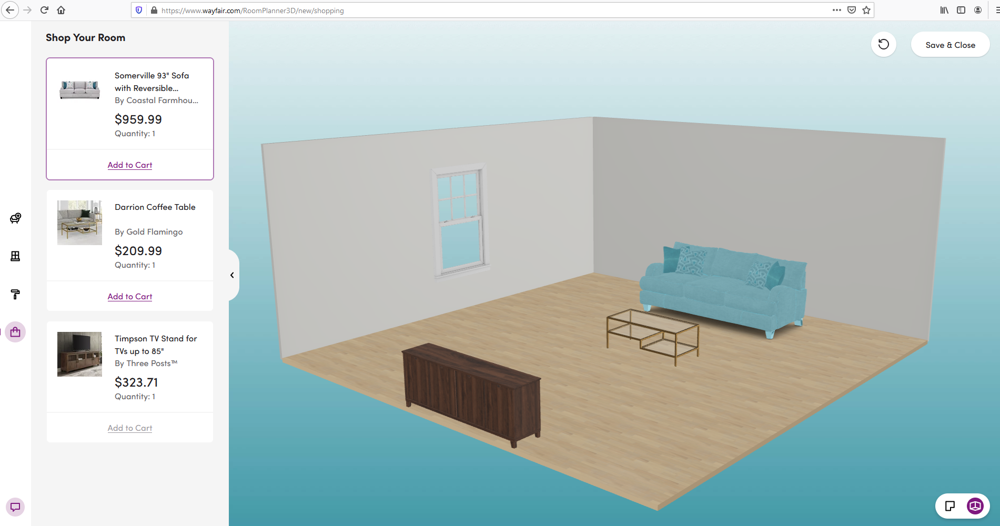
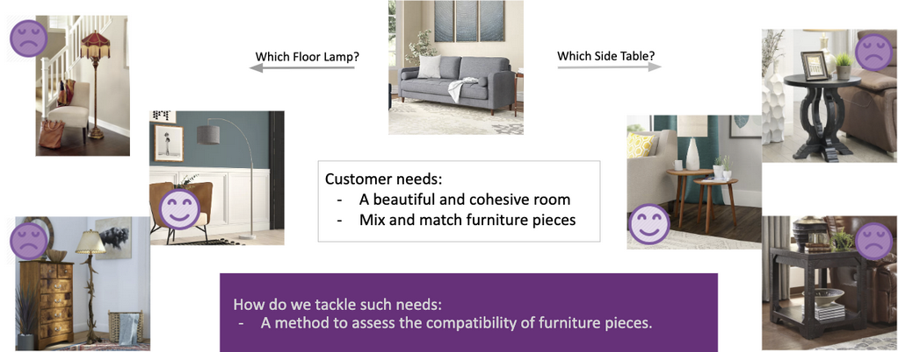

```{r setup, include=FALSE}
knitr::opts_chunk$set(echo = TRUE)
```
### Recommender Systems - Analyzing WayFair's Visual Complements Model recommender system

I have been looking for furniture for my new living room but I was not sure what kind of furniture to get. I needed some ideas and/or advise from someone. I looked at multiple web sites where I found overwhelming variety of styles, sizes, and prices that make it difficult to decide. Fortunately, I came across Wayfair's site, which happens to have a cool feature called "The Room Planner in 3D", which allows customers to plan decoration of a room with true-to-size furniture that fits the customer's space and style.

https://www.wayfair.com/RoomPlanner3D



I found it fascinating how the user interface allows to create floor plan for a room, provide its dimensions, choose the furniture items, place them on the floor plan, move them around, and make sure that they fit the dimensions of the room because the furniture is graphically scaled to the size of the room. This way one can guarantee that the furniture will fit the room.

For this assignment, I thought it would be interesting to find out the type of technology that they use behind the website to recommend the furniture that appear on their user interface. After doing some research I found out WayFair uses multiple recommendation systems to help customers find what they are looking for. In this particular case I will focus on one of their recommender systems called "The Visual Complements Model (ViCs): Complementary Product Recommendations From Visual Cues"


### Scenario analysis

* **The target users**: Wayfair's customers looking for furniture that match their own taste and would like to maintain a cohesive personal style across their home. At the same time they want to expose their customers to the new products, which ususally suffer from a cold start.

* **Users' key goals**: To get furniture recommendations that help mixing-and-matching furniture pieces which are compatible with other pieces chosen by the customer. Ultimately, the customer wants a cohesive style of home. Also, low pricing is a key feature expected by the customers.

* **How to help them meet their goals**: One of WayFair's newest method for aiding customers in their search for complementary items is the "Visual Complements model (ViCs)". Which is uses visual clues to provide complementary product recommendations, the outputs of the model needed to serve as a representation of relative compatibility between products.


### The Visual Complements model (ViCs) recommender system

The Data Science team at WayFair developed a new recommender system called "The Visual Complements Model (ViCs): Complementary Product Recommendations From Visual Cues". 

According to the the DS team, creating a recommendation system for home decoration poses unique challenges: each customer has his/her own taste and would like to maintain a cohesive personal style across his/her home. Their enormous catalog of products makes it difficult to decide what to recommend. In this industry the customer's taste is what is critical in recommending furniture, so describing or measuring taste is a very difficult thing to do.

Also many products come in as individual pieces and not as part of a set necessarily. So, customers try to match/mix pieces, but they also want those pieces to be compatible with their existing furniture that they have at home or that they are currently picking during their browsing session. So, the ViCs system uses imaging to recommend complementary items that will match the images of the products already selected by the user.

Now, in order to accomplish the goals above, as the authors' of the project said, and I quote:

"Most existing recommendation algorithms are built based on customers’ browsing history, e.g., collaborative filtering. But the uncertainty, diversity, and timeliness of each customer’s profile, as well as the absence of new customers’ history, makes it challenging for such algorithms to be robust to all customers. Moreover, models based on customer interactions are often biased and have a strong trend to recommend low-price and popular items. In turn, there might be a cold start problem for new products. At Wayfair, we wanted to find a better way. 

Our newest method for aiding customers in their search for complementary items: the Visual Complements model (ViCs). Rather than depending on customer input, this model leverages an image-based model to understand compatibility from product imagery, thereby mimicking the way customers find the pieces they want and eliminating the cold start problem in the process. ViCs aims to provide an understanding of compatibility for all Wayfair product imagery, and to deliver customer recommendations for complementary, stylistic similar items across product classes."




#### Method used for Vics

Unfortunately, the ViCs algorithms used to compare the images cannot be the same as the techniques used for facial recognition, which typically work with imagery that all belong to the same domain (faces). The features of the images that need to be compared cannot always use the same features among compared products, This is because sometimes it would be necessary to compare a table to a sofa to see if they are complementary to each other (compatible style). The table and sofa are built with different materials and have different attributes. So the algorithms have to pay attention to attributes that may or may not apply to both items. Therefore, other image comparison techniques need to be used.

According to the DS team, they created an embedding space that keeps compatible data points of products close, while pushing non-compatible data points apart. Also, a technique called "Triplet loss [1]", used in facial recognition tasks, can be used in this case as a way to learn representative embeddings for each piece. The triplet loss minimizes the distance between an anchor and a positive which stylistically matches the anchor, and maximizes the distance between the anchor and a negative which are stylistically incompatible. This technique works fine with similar comparison tasks, such as comparing two sofas, but it does not work well when comparing a sofa to a table. So, to solve this, they added a cross-entropy loss for class prediction, so that the model could learn to pay attention to different criteria when looking at different matches of product classes.


#### Training data used

For their training data they used different sources to reduce bias. Importance sampling was performed on the recommendations from their context-based style model "RoSE v2"[2]. They also mined triplets from 3D scene graphs, which 3D artists at Wayfair use as a way to render realistic images for products with 3D models. The captured scenes where images were also curated by a 3D artist so that they are stylistically compatible. Additionally, they leveraged other already existing customer data sources (e.g. RecNet [4]) that contains customers' bias towards buying popular products, which would also provide products that were purchased together.


#### The Model's Architecture

To learn the embedding space, the team used a Siamese Network architecture with triplet loss, where compatible products should be close to each other and vice versa. 

They used transfer learning in their network, the base of our Siamese network being RoSE v3 [2], the team’s previous model which understands the style of room images by learning from comparison, and which itself transfer-learned from ResNet 50 [2].

As far as I am concerned, the theory behind the above techniques is very difficult and dense to understand. But at least I understand that they applied the square of Euclidean distance instead of Euclidean distance, as well as increasing margin with the training process, to facilitate convergence.

#### The results

The model eventually performs binary classification, where the compared items are tagged as positive or negative compatibility based on attributes such as color, shape, material, and style, which the are things that customers would be interested in matching when they choose their furniture. The model also looks at other features found in products that were purchased together by the customer or other customers.

 
### Recommendations to improve the site

One thing that I would recommend to improve the site is that WayFair adds a feature that allows customers to share/upload pictures of their personal decoration projects using purchased products. Such images could be analyzed/curated by WayFair's interior designers and 3D artists, so that some of those images can be added to the training datasets to improve accuracy of image matchings and thus improve item recommendations


### References

[1] Schroff, F., Kalenichenko, D., & Philbin, J. (2015). FaceNet: A unified embedding for face recognition and clustering. 2015 IEEE Conference on Computer Vision and Pattern Recognition (CVPR). doi: 10.1109/cvpr.2015.7298682. P. 5 

[2] https://tech.wayfair.com/data-science/2019/09/wayfair-ds-explains-it-all-ilkay-yildiz-on-learning-from-comparisons/

[3] https://tech.wayfair.com/data-science/2019/12/recnet-deep-learning-based-cross-class-recommendations-at-wayfair/


[4] K. He, X. Zhang, S. Ren, and J. Sun. (2016). Deep residual learning for image recognition. IEEE Conf. on Comp. Vision and Pat. Rec., pp. 770-778,.


